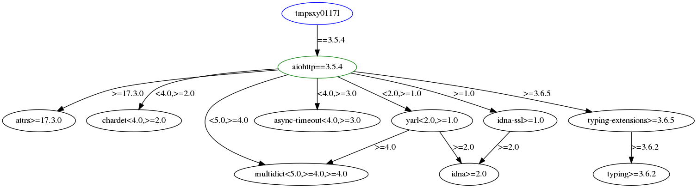

# dephell deps tree

Show dependencies tree for your dependencies  from `from` section or given package.

Show project dependencies:

```bash
$ dephell deps tree
- aiofiles [required: *, locked: 0.4.0, latest: 0.4.0]
- aiohttp [required: *, locked: 3.5.4, latest: 3.5.4]
  - async-timeout [required: <4.0,>=3.0, locked: 3.0.1, latest: 3.0.1]
  - attrs [required: >=17.3.0, locked: 19.1.0, latest: 19.1.0]
  - chardet [required: <4.0,>=2.0, locked: 3.0.4, latest: 3.0.4]
  - idna-ssl [required: >=1.0, locked: 1.1.0, latest: 1.1.0]
    - idna [required: >=2.0, locked: 2.8, latest: 2.8]
  ...
```

Field `locked` shows version that was resolved by this command, **not** the version that represented in any environment or lockfile.

Show dependencies for given package:

```bash
$ dephell deps tree aiohttp==3.5.4
- aiohttp [required: ==3.5.4, locked: 3.5.4, latest: 3.5.4]
  - async-timeout [required: <4.0,>=3.0, locked: 3.0.1, latest: 3.0.1]
  - attrs [required: >=17.3.0, locked: 19.1.0, latest: 19.1.0]
  - chardet [required: <4.0,>=2.0, locked: 3.0.4, latest: 3.0.4]
  - idna-ssl [required: >=1.0, locked: 1.1.0, latest: 1.1.0]
    - idna [required: >=2.0, locked: 2.8, latest: 2.8]
  ...
```

## Graph output

You can specify `--type=graph` to build dependencies graph:

```bash
$ dephell deps tree --type=graph aiohttp==3.5.4
```

It will create next graph in `.dephell_report` directory:



## JSON output

You can specify `--type=json` to generate JSON with information for every node in graph:

```bash
$ dephell deps tree --type=json aiohttp==3.5.4
[
  {
    "best": "3.5.4",
    "constraint": "==3.5.4",
    "dependencies": [
      "attrs",
      "chardet",
      "multidict",
      "async-timeout",
      "yarl",
      "idna-ssl",
      "typing-extensions"
    ],
    "latest": "3.5.4",
    "name": "aiohttp"
  },
  ...
]
```

As for any other command, you can [filter](filters) JSON output:

```bash
dephell deps tree --type=json --filter="#.name+constraint.each()" aiohttp==3.5.4
[
  {
    "constraint": "==3.5.4",
    "name": "aiohttp"
  },
  {
    "constraint": "<4.0,>=3.0",
    "name": "async-timeout"
  },
  ...
]
```

## See also

1. [How to filter commands JSON output](filters).
1. [dephell package outdated](cmd-package-list) to show outdated packages in a lockfile or project virtual environment.
1. [dephell package list](cmd-package-list) to show information about installed packages.
1. [dephell package show](cmd-package-show) to get information about single package.
