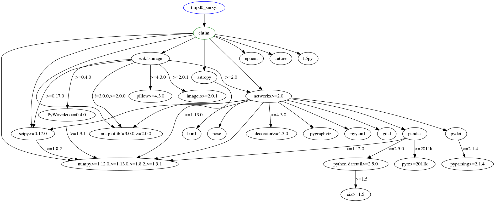

# Make dependencies graph for git repo

Let's make dependencies graph for [ehtim](https://github.com/achael/eht-imaging). This is software that used to [take a photo of black hole](https://www.theguardian.com/science/2019/apr/14/the-new-black-hole-what-can-we-really-see). We can make this graph with [dephell deps tree](cmd-deps-tree) command:

```bash
dephell deps tree --type=graph git+https://github.com/achael/eht-imaging.git#egg=ehtim
```


